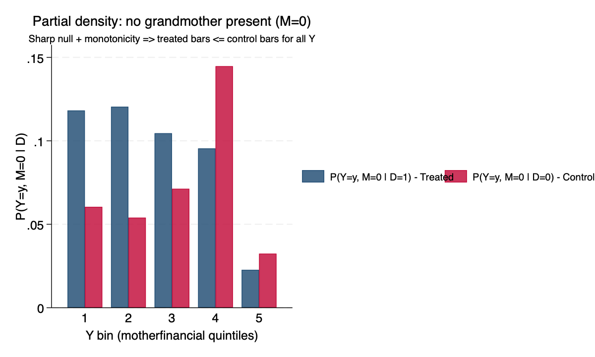

# stata-testmechs (MVP)

This repository contains an **MVP Stata translation** of key functionality from Jon Roth & Soonwoo Kwon's **TestMechs** R package (paper: [*Testing Mechanisms*](https://www.jonathandroth.com/assets/files/TestingMechanisms_Draft.pdf)).

The package provides tests for the **"sharp null of full mediation"** — the hypothesis that a treatment `D` affects an outcome `Y` **only** through a specified mediator `M` (or set of mediators). Rejection means the treatment has a direct effect that is not routed through `M`. It also provides **lower bounds on the fraction of "always-takers"** — the fraction of people whose outcome is affected by the treatment despite having the same value of `M` regardless of treatment status. Both entry-points support randomized treatment (the default) and conditional random assignment or IV via the `reg_formula()` option. As in the paper, the mediator `M` must be discrete.

## Status (MVP scope)

### Implemented
- ✅ `testmechs_lb_fracaffected`  
  Stata translation of the R function `lb_frac_affected()`
- ✅ `testmechs_test_sharpnull`  
  Stata translation of the R function `test_sharp_null()` for `method = "CS"` (Cox and Shi, 2023). Supports single mediators and combinations of mediators.

### Currently supported features
- Positional varlist input:
  - **`d m y`** for a single mediator
  - **`d m1 m2 y`** for a combination of both mechanisms (two-mediator input)
- `atgroup(#)`
- `numybins(#)`
- `maxdefiersshare(#)`
- `allowmindefiers`
- `reg_formula("...")` — OLS with controls and 2SLS IV syntax `(endog = instr)`. Perfect-instrument cases (instrument collinear with treatment) fall back to OLS to match R's `fixest` behavior. Cluster-robust inference via analytic influence functions (sandwich-form `M · x · e · n_reg` for OLS, `M · xhat · e_iv · n_reg` for 2SLS).
- Multi-valued discrete mediators in the default binned-Y path
- Lower bounds combining both mechanisms across two mediator variables
- Cox–Shi sharp null test with cluster-robust standard errors

### Not yet implemented
The following are **not yet implemented** and will return an error:
- 🚫 `continuousy`
- 🚫 `returnmindefiers`
- 🚫 Sharp-null methods other than `CS` (e.g., `ARP`, `FSST`, `toru`)
- 🚫 Specialised binary-M code path (see "Notes" below)
- 🚫 `fixest`-style fixed-effect syntax (`| interviewer`) and IV-with-FE combined syntax
- 🚫 `bounds_ade_ats` — no Stata equivalent yet
- 🚫 `partial_density_plot` — no Stata command yet, but see the "Graphical evidence" section below for a manually-generated version and a reproducible do-file (`tests/verify/make_partial_density_figure.do`)

The original R source is kept under `r_reference/` for translation and validation.

---

## Data (for replication)

This repo includes two Stata datasets converted from the TestMechs R package data (`.rda`) for convenience:

- `baranov_data.dta`  
  Raw dataset converted from the R package data object `baranov_data`
- `mother_data.dta`  
  Analysis dataset corresponding to the experimental sample used in the README examples, created by restricting to `THP_sample == 1`

### Notes
- These `.dta` files are provided for quick replication in Stata.
- They are derived from the original R package data; see `r_reference/` for the upstream source.

---

## Installation

Install using `net install` from GitHub:

```stata
cap noi net uninstall testmechs
net install testmechs, from("https://raw.githubusercontent.com/chengchen2326/stata-testmechs/main") replace
```

You can verify that Stata finds the installed command with:

```stata
which testmechs_lb_fracaffected
help testmechs_lb_fracaffected
```

### Dependencies

`testmechs_test_sharpnull` uses three bundled Stata plugins for all its numerical work. It requires:

- **Stata 16+**

That's it — no Python installation, no external solver libraries. Rank computation (via `dqrdc2`), the linear programs (via GLPK 5.0), and the quadratic program (via OSQP 0.6.3) all run inside statically-linked Stata plugins.

### Bundled plugins

`testmechs_test_sharpnull` ships with three precompiled Stata plugins.

**`_testmechs_dqrdc2_rank.plugin`** calls R's `dqrdc2` Fortran routine for computing matrix rank. This is necessary because R's `qr(M, tol)$rank` uses a 1995 modification of LINPACK's `dqrdc` written by Ross Ihaka specifically for R, with a custom column-pivoting strategy that gives different results from generic SVD-based rank on near-rank-deficient matrices. Without this plugin, the Stata p-values would differ from R for several test cases. See `src/dqrdc2_src/` for the Fortran/C sources.

**`_testmechs_glpk_lp.plugin`** solves the linear programs used by the Cox–Shi test. It statically links GLPK 5.0 (the same LP solver used by R's `Rglpk_solve_LP`), so users do not need to install GLPK or `swiglpk`. See `src/glpk_lp_src/` for the C source and `src/glpk_src/` for the bundled GLPK tarball.

**`honestosqp_plugin.plugin`** solves the quadratic program used by the Cox–Shi test. It statically links OSQP 0.6.3. The plugin is a light modification of Mauricio Cáceres Bravo's OSQP plugin from HonestDiD, extended to expose the `eps_abs` and `eps_rel` convergence tolerances so we can set them to 1e-8 (to match R's TestMechs) instead of HonestDiD's default 1e-5. See `src/osqp_qp_src/` for the C source and modification details.

All three plugins are pre-shipped for **macOS Apple Silicon**, **macOS Intel (x86_64)**, **Linux x86_64**, and **Windows x86_64**. Linux and Windows binaries are built automatically on GitHub Actions from `.github/workflows/build-plugins-linux.yml` and `.github/workflows/build-plugins-windows.yml`; macOS binaries are built locally per the build scripts under `src/dqrdc2_src/`, `src/glpk_lp_src/`, and `src/osqp_qp_src/`. Only the macOS Apple Silicon binaries have been run end-to-end against the R baseline; the other three platforms are architecture-verified but not yet Stata-verified.

---

## Application to Baranov et al. (2020)

The examples below walk through applying the package to the setting of [Baranov et al. (2020)](https://www.aeaweb.org/articles?id=10.1257/aer.20180511), which is used as the running example in Section 5.2 of *Testing Mechanisms*. Baranov et al. randomized access to cognitive behavioral therapy (CBT) for depression among new mothers in Pakistan, with treatment assigned at the level of the Union Council (40 clusters, 20 treated and 20 control, roughly 600 women in total). They find that CBT substantially reduces depression rates and increases mothers' **financial empowerment** (a composite index covering work outside the home, control over finances, etc.).

They would like to understand **which mechanisms** drive the effect of CBT on financial empowerment. Two candidate mediators appear plausible:

- **`grandmother`** — a binary indicator for whether a grandmother is present in the home (child-care support that might free the mother to work)
- **`relationship_husb`** — the quality of the woman's relationship with her husband, on a 1–5 scale (a healthier household environment)

In the notation of the paper, `D = treat`, `Y = motherfinancial`, and `M` is one (or a combination) of the two candidate mediators. The core question is: **does the treatment effect operate entirely through `M`?** If so, we would fail to reject the sharp null of full mediation for that `M`. If not, the direct effect (through mechanisms other than `M`) is what the lower-bound calculation quantifies.

We first show the standard randomized-assignment analysis (examples 1–8), then re-do the same tests with regression adjustment and IV (examples 9–10) to show how the package handles conditional random assignment and non-experimental settings.

---

## Examples

### 1. Lower bound on the fraction of never-takers affected

Before we get to the formal test, it helps to see the size of the "residual mechanism" the test is trying to detect. If the treatment operated entirely through `grandmother` presence, then people whose grandmother status is the same under both treatment and control (the never-takers, with `M = 0`, and the always-takers, with `M = 1`) should have identical outcome distributions across treatment arms. The **lower bound on the fraction of never-takers affected by treatment** is a point estimate of how much this identical-distribution assumption is violated in the data — i.e. what fraction of never-takers must have a direct effect of `D` on `Y` not routed through `M`.

The argument `atgroup(0)` picks the never-taker sub-group (people with `M = 0` under both treatments, i.e. no grandmother). In the paper's more general notation, this is the "0-always-takers" bound.

```stata
use "data/mother_data.dta", clear

* varlist order is: d m y
testmechs_lb_fracaffected treat grandmother motherfinancial, ///
    numybins(5) atgroup(0)
```

**Expected output:** `lower bound = 0.185891` (matches R benchmark of `0.1858912`).

**Interpretation.** At least **19 percent** of never-takers are affected by the treatment despite having no grandmother present in either treatment arm. That's a substantial residual channel, and it is what the formal test in example 5 will pick up as a rejection of the sharp null. You can request the analogous bound for always-takers with `atgroup(1)` (in this application the lower bound is zero — no evidence of a direct effect among people who already had a grandmother). Omitting `atgroup()` pools across always-takers and never-takers, matching R's `at_group = NULL` behavior.

---

### 2. Lower bound under relaxed monotonicity (`maxdefiersshare`)

The default calculation assumes **monotonicity**: treatment can only increase `M`. In this application, this means that everyone who would have a grandmother present without receiving CBT would also have one present when receiving CBT (no "defier" who loses a grandmother because of CBT). Monotonicity is a maintained assumption in many mediation frameworks but is testable to some extent, and in some applications you may want to relax it. `maxdefiersshare(#)` allows a positive share of the population to be defiers, and the lower bound is re-computed under that relaxed constraint.

```stata
use "data/mother_data.dta", clear

testmechs_lb_fracaffected treat grandmother motherfinancial, ///
    numybins(5) atgroup(0) maxdefiersshare(.01)
```

**Expected output:** `lower bound = 0.171642` (matches R benchmark of `0.1716415`).

**Interpretation.** Allowing up to 1% of the population to be defiers lowers the estimated bound only slightly, from 19% to 17%. The estimated direct-effect channel is robust to a small monotonicity violation. Allowing progressively larger defier shares will eventually shrink the bound to zero.

---

### 3. Multi-valued mediator example with `allowmindefiers`

`relationship_husb` is measured on a 1–5 scale, so it is a **multi-valued discrete mediator**. The lower-bound machinery still applies; we just pool across always-taker types (all subgroups with the same value of `M` under both treatments) by omitting `atgroup()`. The empirical distribution here suggests a small amount of monotonicity violation, so we pass `allowmindefiers` — this asks the command to raise the defier cap to the smallest value the data can accommodate, rather than erroring out.

```stata
use "data/mother_data.dta", clear

* omit atgroup() to match R's at_group = NULL (pooled across always-taker types)
testmechs_lb_fracaffected treat relationship_husb motherfinancial, ///
    numybins(5) allowmindefiers
```

**Expected output:** `lower bound = 0.100221` (matches R benchmark of `0.1002207`).

**Interpretation.** At least **10 percent** of always-takers (pooled across relationship-quality levels) are affected by treatment through channels other than relationship quality. The bound is nontrivial but smaller than the grandmother bound (19%), suggesting relationship quality "explains more" of the treatment effect than grandmother presence, though neither explains it fully.

*A caveat on discretization.* The paper's method works for multi-valued discrete mediators like this 1–5 scale, but statistical power decreases as `M` approaches a continuous variable — see Remarks 2 and 3 of the paper.

---

### 4. Combination of both mechanisms: lower bound across two mediator variables

The final piece of the story is: what if **both** mechanisms (grandmother AND relationship quality) together account for the treatment effect? The package computes a joint bound on the fraction of always-takers affected across both mediators by passing both mediator variables in the varlist.

```stata
use "data/mother_data.dta", clear

* varlist order is: d m1 m2 y
testmechs_lb_fracaffected treat relationship_husb grandmother motherfinancial, ///
    numybins(5) allowmindefiers
```

**Expected output:** `lower bound = 0.072513` (matches R benchmark of `0.07251284`).

**Interpretation.** When we allow the two mediators to *jointly* account for the treatment effect, the residual "unexplained" fraction of always-takers falls to about **7 percent**. This is a point estimate; its statistical significance is addressed by the sharp-null test in example 8.

---

## Graphical evidence

Before running the formal test in example 5, it is often helpful to look at
the data visually. The R package provides `partial_density_plot()` for this.
The Stata port does not yet ship an equivalent command, but the same figure
is easy to build with `graph bar`. Below is the Stata version of the R
README's `nt_plot` (see `tests/verify/make_partial_density_figure.do` for
the reproducible code).

The plot shows the two estimated conditional probabilities

- P(Y = y, M = 0 | D = 1) — treated group with no grandmother present
- P(Y = y, M = 0 | D = 0) — control group with no grandmother present

for each Y bin. Under monotonicity, treatment can only add grandmothers, not
remove them, so the treated distribution on M = 0 should stochastically lie
**below** the control distribution — in particular, the **treated bars
should be no taller than the control bars** for each Y value. A treated bar
that is visibly taller than the corresponding control bar is a data-level
violation of the sharp null.



**What we see.** For Y bins 1, 2, and 3 (the bottom three-fifths of the
financial empowerment index), the treated bars are visibly *taller* than
the control bars — the opposite of what monotonicity + full mediation would
predict. This is exactly the pattern of sharp-null violation the formal
Cox–Shi test picks up as a rejection in example 5 (p ≈ 0.023). The high
control bar at Y bin 4 goes the "right" way (control > treated), which
partly attenuates the total violation but is not enough to save the null.

The figure is not a substitute for the formal test — it does not
carry uncertainty quantification, and small differences between the bars
could plausibly be sampling noise. But it makes the mechanism concrete: the
Cox–Shi test is checking whether the pattern of inequality violations in
this kind of picture is large enough to be inconsistent with the sharp null.

---

### 5. Testing the sharp null of full mediation (Cox and Shi, 2023)

The lower-bound calculations above give point estimates but no uncertainty quantification. The **sharp null test** conducts statistical inference for the hypothesis of full mediation using the method in Section 4 of the paper. The recommended default is the Cox and Shi (2023) test (`method(CS)`). Other methods (`ARP`, `FSST`, and — when `M` is binary — `toru`) are in the R package but **not** in this Stata MVP.

```stata
use "data/mother_data.dta", clear

testmechs_test_sharpnull treat grandmother motherfinancial, ///
    method(CS) numybins(5) cluster(uc)
```

**Expected output** (matches R):
- `test_stat = 7.558558`
- `cv        = 5.991465`
- `p-value   = 0.02283916`

**Interpretation.** The p-value is about **0.023**, so we reject the sharp null at the 5% significance level. **The treatment effect on financial empowerment does not operate entirely through the presence of a grandmother.** This is what the point-estimate lower bound in example 1 already hinted at — at least 19% of never-takers are affected — but now with formal inference.

*A few practical points.*
- The reported p-value corresponds to the smallest α at which the test rejects, following the R convention.
- The test relies on a central-limit-theorem approximation within cells defined by `(Y, M, D)` (and clusters, when `cluster()` is set). Choose `numybins()` small enough that the CLT is credible within each cell. Here `numybins(5)` gives ~60 observations per cell, which is comfortable.
- `cluster(uc)` cluster-adjusts the standard errors at the Union Council level, matching Baranov et al.'s randomization design.

---

### 6. Results for an alternative mechanism (`relationship_husb`)

We repeat the sharp-null test using **relationship quality with the husband** (the 1–5 scale) as the mediator. Multi-valued `M` is handled directly — no special option needed.

```stata
use "data/mother_data.dta", clear

testmechs_test_sharpnull treat relationship_husb motherfinancial, ///
    method(CS) numybins(5) cluster(uc)
```

**Expected output** (matches R):
- `test_stat = 10.843249`
- `cv        = 9.487729`
- `p-value   = 0.02838332`

**Interpretation.** With p ≈ 0.028, we also reject full mediation through relationship quality alone. As with grandmother presence, some direct effect of CBT on financial empowerment remains unexplained by this single mediator.

---

### 7. Sharp null test under relaxed monotonicity (`maxdefiersshare`)

Just as `maxdefiersshare()` relaxes monotonicity in the lower-bound calculation (example 2), it does the same for the sharp-null test: instead of forbidding defiers entirely, we allow up to a specified share and re-test.

```stata
use "data/mother_data.dta", clear

testmechs_test_sharpnull treat grandmother motherfinancial, ///
    method(CS) numybins(5) cluster(uc) maxdefiersshare(0.01)
```

**Expected output** (matches R):
- `test_stat = 6.144824`
- `cv        = 5.991465`
- `p-value   = 0.04630932`

**Interpretation.** Allowing 1% defiers moves the p-value from 0.023 to 0.046 — still a rejection at the 5% level. The conclusion (some direct effect remains) is robust to small monotonicity violations. As you increase `maxdefiersshare()`, the test loses power and will eventually fail to reject.

---

### 8. Combination of both mechanisms: sharp null test

The most interesting test is whether the treatment effect can be explained by the **combination** of the two mechanisms — grandmother presence *and* relationship quality — together. In the R package this is done by passing a vector of variable names; in the Stata port, pass both mediators in the varlist.

```stata
use "data/mother_data.dta", clear

* varlist order is: d m1 m2 y
testmechs_test_sharpnull treat grandmother relationship_husb motherfinancial, ///
    method(CS) numybins(5) cluster(uc)
```

**Expected output** (matches R):
- `test_stat = 7.741333`
- `cv        = 18.307038`
- `p-value   = 0.65408650`

**Interpretation.** With p ≈ 0.65, we **cannot reject** the sharp null that the combination of grandmother presence and relationship quality fully explains the treatment effect. Neither mediator alone was sufficient (examples 5 and 6), but jointly they can account for the effect. This is the finding highlighted in Section 5.2 of the paper.

The point-estimate lower bound in example 4 told the same story from a different angle: the residual unexplained fraction is only ~7%, and this test says that residual is not statistically distinguishable from zero.

---

## Non-experimental setting

The examples above assume treatment is **randomly assigned** — the default in the package. In that setting, treatment effects are estimated by comparing means for the treated and control groups within `(y, m)` cells. In many applied settings, however, treatment is only **conditionally** randomly assigned given a set of observable characteristics, or is assigned non-randomly but with a valid instrumental variable available. Both entry-points (`testmechs_test_sharpnull` and `testmechs_lb_fracaffected`) support these settings via the `reg_formula()` option.

### How `reg_formula()` works

`reg_formula()` takes a **string** describing the right-hand side of a regression that will be run *inside* the package for each `(y, m)` cell. Under the hood, the package builds the cell indicator `(Y = y_val) & (M = m_val)` as the LHS of the regression, and the string you provide gives the RHS.

The string uses **R-style formula syntax** (this is inherited from the R package's convention, which in turn defers to `fixest`):

- **Leading tilde `~`** — required. Marks the string as a formula. You do *not* write anything to the left of `~`; the LHS is generated internally by the command as the cell indicator.

- **`+` separates covariates** — e.g. `"~ treat + age + education"`. Not commas (that's Stata's default) — for compatibility with the R form.

- **`(endog = instrument)` for 2SLS IV** — parenthesised, with `=` inside. For example, `"~ age + education + (treat = eligibility)"` says: run 2SLS with `treat` as the endogenous variable and `eligibility` as its instrument, and `age` and `education` as exogenous controls. The syntax mirrors Stata's own `ivregress` convention.

Two supported forms:

| Form | Example | What it runs internally |
|---|---|---|
| **OLS with controls** | `"~ treat + age + educ + wealth"` | `regress lhs treat age educ wealth` in each `(y, m)` cell; grabs `_b[treat]` as the estimate |
| **2SLS IV** | `"~ age + educ + wealth + (treat = iv)"` | `ivregress 2sls lhs age educ wealth (treat = iv)` in each cell; grabs `_b[treat]` |

**Perfect-instrument fallback.** If the instrument is collinear with the treatment (Stata returns `r(481)`), the command silently falls back to OLS treating the "endogenous" variable as a regular regressor. This matches the behavior of R's `fixest::feols` in the same degenerate case, so an instrument that is a copy of the treatment produces identical results as the OLS-with-controls form.

**Contrast with native Stata syntax.** In a normal `regress` call you would write:
```stata
regress motherfinancial treat age_baseline edu_mo_baseline wealth_baseline
```
Inside `reg_formula()`, the LHS is not `motherfinancial` — the package rewrites it internally to `(y_bin == y_val & grandmother == m_val)` for each cell. What you provide is only the RHS, and the option takes it as an R-style string:
```stata
reg_formula("~ treat + age_baseline + edu_mo_baseline + wealth_baseline")
```
The reason for the string form (rather than a native Stata `regress`-style varlist) is to keep the option's syntax identical across Stata and R, so the same formula string works in both ports.

**Cluster-robust inference under `reg_formula()`** uses analytic per-observation influence functions of the sandwich form:
- For OLS: `IF_i = M[j,:] * x_i * e_i * n_reg` with `M = (X'X)^{-1}`.
- For 2SLS: `IF_i = M[j,:] * xhat_i * e_iv,i * n_reg` where `xhat` substitutes first-stage fitted values for the endogenous variable and `M = e(V)/e(rmse)^2`.

These reproduce R's `sandwich::estfun(feols) %*% t(sandwich::bread(feols))` per observation to machine precision on the same data — see `tests/verify/` for the element-wise verification.

### 9. Sharp null with regression-adjusted probabilities (OLS controls)

We use `reg_formula("~ treat + age_baseline + edu_mo_baseline + wealth_baseline")` to control linearly for three baseline covariates while estimating the partial probabilities cell-by-cell.

```stata
use "data/mother_data.dta", clear

testmechs_test_sharpnull treat grandmother motherfinancial, ///
    method(CS) numybins(5) cluster(uc) ///
    reg_formula("~ treat + age_baseline + edu_mo_baseline + wealth_baseline")
```

**Expected output** (matches R):
- `test_stat = 6.944244`
- `cv        = 5.991465`
- `p-value   = 0.03105106`

**Interpretation.** Adjusting for baseline covariates changes the p-value slightly from 0.023 (unadjusted, example 5) to 0.031. Both reject the sharp null at 5%. In this application the adjustment costs a small amount of power because the covariates absorb some of the treatment-effect variation, but the qualitative conclusion is unchanged: **there is still a direct channel of CBT on financial empowerment not explained by grandmother presence**, even after controlling for age, education, and baseline wealth. In settings where treatment is only conditionally random (i.e. assignment probability depends on observables), the adjusted version is the one that provides valid inference.

---

### 10. Sharp null with an instrumental variable (2SLS IV)

We can also use `reg_formula()` to plug in a 2SLS IV. To illustrate, we construct a noisy instrument for `treat` and pass IV syntax to `reg_formula()`. The construct `(treat = iv)` inside the formula tells the command to instrument `treat` with `iv`, mirroring `ivregress 2sls`.

```stata
use "data/mother_data.dta", clear

* Construct a noisy instrument
set seed 0
gen double iv = treat + rnormal(0, 0.1)

* IV syntax inside reg_formula uses (endog = instr)
testmechs_test_sharpnull treat grandmother motherfinancial, ///
    method(CS) numybins(5) cluster(uc) ///
    reg_formula("~ age_baseline + edu_mo_baseline + wealth_baseline + (treat = iv)")
```

**Notes on expected output.**

- **Numerical result depends on random-number generator.** Stata's `rnormal(0, 0.1)` and R's `rnorm(sd = 0.1)` use different random-number streams, so the constructed `iv` variable will differ between the two runs even with the same seed. The Stata p-value will therefore not equal the corresponding R p-value exactly; only the analytical procedure is the same. To get an exact numerical match against R, users would need to construct `iv` in R and export it (e.g. via `write_dta()`) or use a common noise source.
- **Perfect-instrument case.** If the instrument were an exact copy of the treatment (Stata error `r(481)` from `ivregress`), the helper falls back to OLS with the endogenous variable as a regular regressor. This mirrors R's `fixest` behavior in the same degenerate case, so an instrument equal to `treat` produces identical point estimates and IFs as OLS-with-controls.

---

## Notes on numerical agreement with R

All Cox–Shi p-values reported above match the R benchmark to at least 7 decimal places for the non-IV examples. Achieving this agreement required two design choices:

1. **GLPK as the LP solver.** Earlier versions of this package used HiGHS (via `scipy.optimize.linprog`). HiGHS gave correct test statistics but selected slightly different LP vertices in near-degenerate cases, which propagated to small differences in the constraint-binding count and therefore the chi-squared degrees of freedom. Switching to GLPK (the same solver R uses) eliminates this source of disagreement. GLPK is now embedded directly in the bundled plugin `_testmechs_glpk_lp.plugin` — no `swiglpk` or system GLPK required.

2. **R's `dqrdc2` for rank computation.** R's `qr(M, tol)$rank` uses `dqrdc2.f` — a 1995 modification by Ross Ihaka of LINPACK's `dqrdc`, available only in R's source tree. It applies a custom column-pivoting strategy that diverges from generic SVD-based or LAPACK QR rank computations on near-rank-deficient matrices. The difference is rare but consequential: for the `relationship_husb` test, SVD-based rank gave dof = 5 where `dqrdc2` gives dof = 4, leading to p-values of 0.0546 vs 0.0284. We therefore ship a precompiled Stata plugin (`src/_testmechs_dqrdc2_rank.plugin`) that calls `dqrdc2` directly from Mata, matching R's rank exactly.

For **`reg_formula` cases**, the OLS-with-controls path also matches R exactly (see example 9). The IV path reproduces R's sandwich-form influence function per observation to machine precision (verified in `tests/verify/`), so end-to-end p-values match R exactly for `K ≥ 3` (multi-valued or combined mediators). For `K = 2` (binary M) IV cases, however, R auto-dispatches to a specialised `test_sharp_null_binary_m` code path (with a different Cox–Shi variant tuned for the binary-M no-nuisance case). The Stata port only implements the general CS code path, so **binary-M IV p-values may differ from R's binary-M-path p-values**. The general CS output remains a valid CS test; porting the binary-M specialisation is on the roadmap pending priority.

---

## Notes

- The current Stata implementation is designed to match the R package benchmarks for the supported default / binned-Y path and the `reg_formula` OLS / 2SLS IV paths.
- Unsupported options such as `continuousy` will return an error rather than silently falling back to another behavior.
- Additional sharp-null methods from the R package (`ARP`, `FSST`, `toru`) are not yet implemented and will return an error.
- The specialised binary-M code path (used by R for K = 2 IV cases) is not ported; users get valid general-CS output on those cases but the exact p-value will differ from R.
- The default degree-of-freedom algorithm (`new_dof_CS = FALSE`) is implemented; the alternative (`new_dof_CS = TRUE`) Cox–Shi formulas remain on the roadmap.
- `fixest`-style fixed-effect syntax (`| interviewer`) and IV-with-FE combined syntax are not supported; use `i.interviewer` explicitly on the RHS as a workaround for fixed effects.
